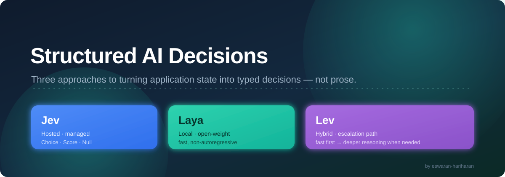
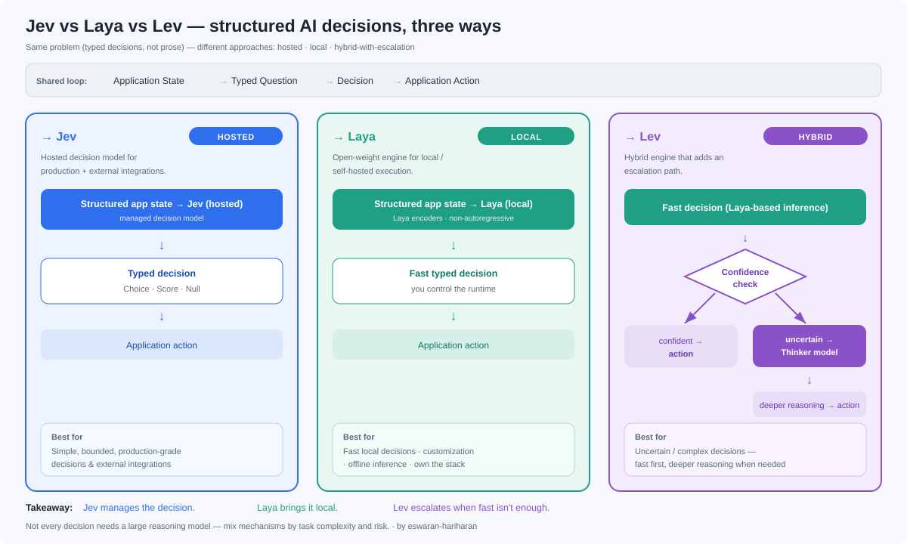
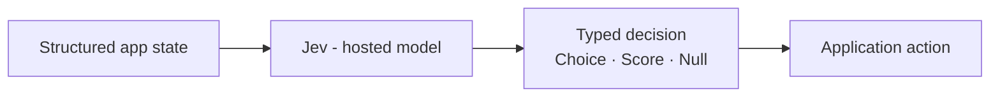
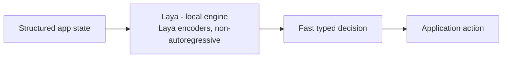
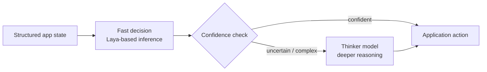

# Jev vs Laya vs Lev — Structured AI Decisions, Three Ways

> **In one sentence:** Jev, Laya, and Lev all solve the same problem — **structured AI decisions** instead of free-form text — but they take very different approaches: **Jev is hosted** (managed, for production), **Laya is local** (open-weight, self-hosted, fast), and **Lev is hybrid** (fast decisions first, with an escalation path to deeper reasoning when needed).

---

## The shared problem

When an AI system needs to decide **what should happen next**, you don't always need unrestricted reasoning. The right tool depends on the task:

- **Sometimes you need a fast, structured decision.**
- **Sometimes you need local execution.**
- **And sometimes the decision needs deeper reasoning.**

All three engines turn **application state** into a **typed decision** — but each optimizes for a different one of those needs.

That's the core loop. The interesting part: **not every decision needs a large reasoning model.** A production system can mix decision mechanisms based on the **complexity and risk** of each task.

---

## → Jev — the hosted decision model

**Jev** is a **hosted decision model** designed for **production applications and external integrations**.

- Takes **structured application state** as input.
- Returns **typed decisions** such as **Choice**, **Score**, or **Null**.
- Managed for you — ideal when you want reliability and integration without running the engine yourself.

**Jev manages the decision.**

---

## → Laya — the local decision engine

**Laya** is an **open-weight decision engine** designed for **local or self-hosted execution**.

- Uses **Laya encoders** to make **fast, non-autoregressive decisions** (it doesn't generate token-by-token — it decides).
- Gives you **more control over the runtime** — customization, offline inference, and local data handling.
- Great when you want to own the stack or run without a hosted dependency.

**Laya brings decision inference local.**

---

## → Lev — the hybrid decision engine with escalation

**Lev** is a **hybrid decision engine** that adds an **escalation path**.

- Handles **common decisions quickly** with **Laya-based inference**.
- Runs a **confidence check** on each fast decision.
- **Routes uncertain or complex cases to a deeper reasoning ("thinker") model** only when needed.

So you get speed for the easy cases and depth for the hard ones — without paying the cost of heavy reasoning on every call.

**Lev adds an escalation path when fast decisions aren't enough.**

---

## The architecture, side by side

**The common pattern:**

> Application State → Typed Question → Decision → Application Action

**And for Lev, with escalation:**

> Fast Decision → Confidence Check → Thinker Model (when needed) → Action

---

## When should you use each?

| Your decision is… | Use | Why |
|-------------------|-----|-----|
| **Simple, bounded** — structured choices with clear intent | **Jev** | Hosted, reliable typed decisions for production + external integrations |
| **Fast + local** — you want local control, customization, or offline inference | **Laya** | Open-weight, self-hosted, fast non-autoregressive decisions |
| **Uncertain or complex** — hard to call confidently up front | **Lev** | Fast decision first, deeper reasoning only when required |

---

## Side-by-side comparison

| | **Jev** | **Laya** | **Lev** |
|---|---------|----------|---------|
| **Type** | Hosted decision model | Open-weight local engine | Hybrid engine with escalation |
| **Runs where** | Hosted / managed | Local or self-hosted | Local fast path + deeper model |
| **Inference style** | Managed decision model | Laya encoders, non-autoregressive | Laya-based fast + thinker fallback |
| **Output** | Typed: Choice · Score · Null | Fast typed decision | Fast decision, escalates if uncertain |
| **Best for** | Production + external integrations | Local control, customization, offline | Uncertain / complex, mixed-risk tasks |
| **Trade-off** | Depend on hosted service | You run + maintain it | More moving parts (confidence + thinker) |
| **Mental model** | *Manages* the decision | *Localizes* the decision | *Escalates* the decision |

---

## The key takeaway

- **Jev manages the decision.** — hosted, typed, production-ready.
- **Laya brings decision inference local.** — open-weight, fast, self-hosted.
- **Lev adds an escalation path** when fast decisions aren't enough — speed first, depth on demand.

The real insight: **a production system can use different decision mechanisms depending on the complexity and risk of the task** — not one large reasoning model for everything.

> **Save this comparison for your next AI agent or decision-system project.**

---

*This page summarizes a conceptual comparison of Jev, Laya, and Lev as structured-AI-decision approaches. Confirm exact capabilities, APIs, and availability against each project's official documentation before relying on them in production.*
